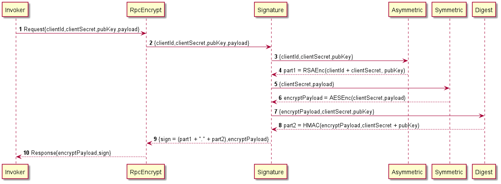
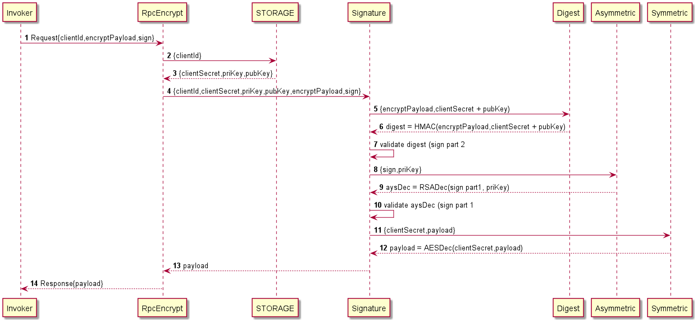

## 三方接口签名验签简易设计与实现

> 本人水平有限，对密码学的理解相当浅显。错误与疏漏，欢迎各位指正。

### 〇、写在前面

1. 接口安全防护是个永恒的话题，提供给前端的接口需要登录，提供给服务的接口(下文简称"**三方接口**")也需要鉴权；
2. 当前大环境下,`http restful`(甚至不restful)盛行，因为简单。性能上，额...至少比soap webservice好；
3. 对于三方接口鉴权，规范的协议有不少，比如`OAUTH2`, 但完整的OAUTH2协议对客户端有着苛刻的要求，阉割的OAUTH2协议看起来好像没啥用(我个人这么觉得);
4. 除了鉴权，还有一个难点是**防劫持**。如果被劫持了，包括鉴权在内的所有请求都不再可信；
5. 防劫持的唯一可靠措施似乎是`https`，然而总有一些网站没有https，包括一些从来不会被攻击，但是天天报漏洞需要修复的头疼系统；
6. 即使如此，也不能破罐子破摔，多加点防护，提升点攻击成本，至少一眼看起来没啥问题。这样就差不多了。

### 一、整体设计

#### 1.1 大体思路

1. 服务端维护客户服务列表，仅提供服务给已知的客户端；
2. 客户端持有两个密钥, 一个是对称加密的密钥，一个是非对称加密的公钥，两个密钥同时泄露请打110. 客户端发出请求前，使用公钥加密少量信息(例如客户端标识等)，使用对称密钥加密请求体，最后使用加密后的请求体加盐(例如两个密钥组合起来)生成摘要，**签名由非对称加密后的字符串拼接摘要组成**；
3. 服务端接收到请求后，查询客户服务列表获取密钥等信息，对比摘要后，私钥解密对比签名的剩余部分，最后对称解密。

#### 1.2 详细设计 

##### 1.2.1 服务属性

| 属性名称         | 中文释义     | 备注         |
| ---------------- | ------------ | ------------ |
| clientId         | 服务唯一标识 |              |
| clientSecret     | 对称密钥     |              |
| privateKeyServer | 服务端私钥   | 仅服务端持有 |
| publicKeyServer  | 服务端公钥   |              |

##### 1.2.2 客户端处理流程

程序参与方:
- Invoker: 调用者，即程序引用方;
- RpcEncrypt: 程序入口；
- Signature: 签名接口，客户端签名和服务端验签等逻辑在这里实现; 
- Digest: 摘要接口，默认实现为HMAC;
- Asymmetric: 非对称加密接口，默认实现为RSA；
- Symmetric: 对称加密接口，默认实现为AES;

- Storage: 存储接口，默认实现为内存。

##### 1.2.3 服务端端处理流程

##### 1.2.4 程序设计

### 二、代码实现

- github

  https://github.com/jiashuaizhang/rpc-encrypt

- gitee

  https://gitee.com/cheapCabbage/rpc-encrypt
